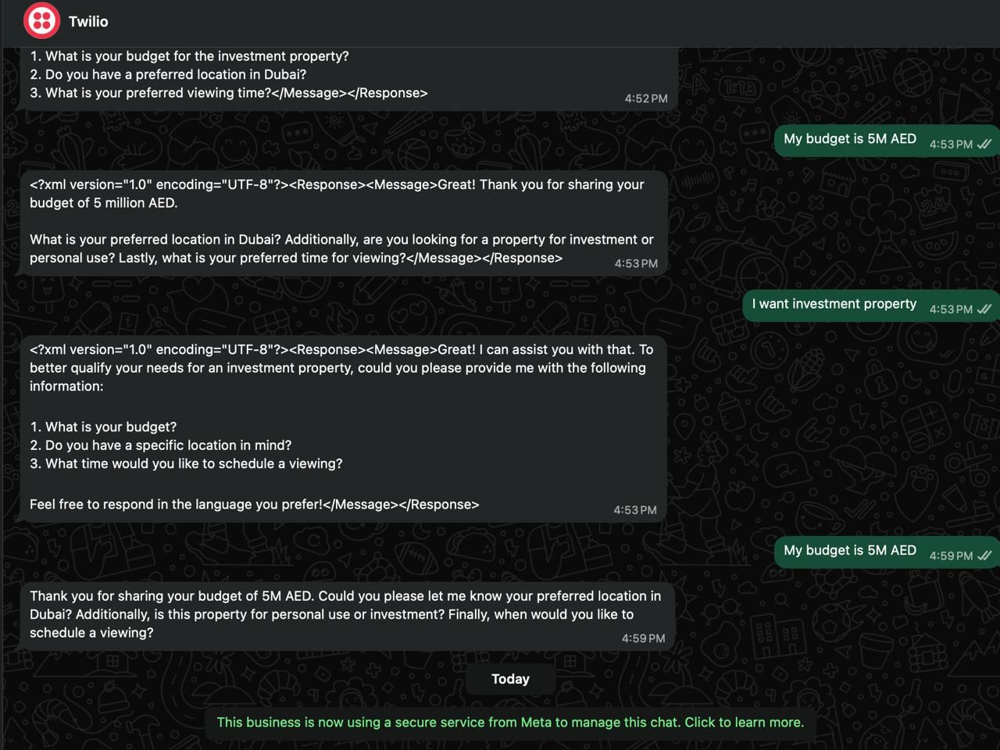

# Dubai Real Estate WhatsApp Lead Qualification Agent

An AI-powered WhatsApp agent that qualifies inbound property enquiries through natural conversation — tracking budget, purpose, location, and timeline without ever repeating a question already answered.

Built with **GPT-4o-mini**, **FastAPI**, and **Twilio WhatsApp Business API**. Tested and running in production.

---

## Demo

Real conversation with the agent running live via Twilio:



The agent:
- Recognises "My budget is 5M AED" and stores it
- Recognises "I want investment property" and stores purpose
- Never asks for budget again once it is captured
- Responds in the same language the user writes in (English, Arabic, Russian)

---

## What It Does

1. Receives inbound WhatsApp messages via Twilio webhook
2. Extracts lead signals from each message — budget, purpose, interest, location, timeline
3. Persists what each contact has already shared across the conversation
4. Generates memory-aware replies via GPT-4o-mini — skipping questions already answered
5. Progressively qualifies the lead toward a property viewing in Dubai

---

## Architecture

```
WhatsApp (Twilio)
       │
       ▼
FastAPI  /webhook
       │
       ├── lead_memory.py     Load contact's known details
       │
       ├── app.py             Extract signals → build memory context
       │
       └── openai_service.py  GPT-4o-mini generates reply
              │
              ▼
       TwiML Response → WhatsApp
```

---

## Lead Memory

Each contact builds a qualification profile across the conversation:

| Field    | Captured when message contains                          |
|----------|---------------------------------------------------------|
| Budget   | "budget", "price", "cost", "afford", "spend"            |
| Purpose  | "investment", "rental yield" / "personal", "own use"    |
| Interest | "villa", "apartment", "studio", "penthouse", "townhouse"|
| Location | "Marina", "Downtown", "Palm", "JVC", "Business Bay"...  |
| Timeline | "ASAP", "urgent", "this month", "next month", "ready"   |

Once a signal is captured it is injected into every subsequent prompt — the AI never asks for it again.

---

## Tech Stack

| Layer      | Technology                        |
|------------|-----------------------------------|
| LLM        | GPT-4o-mini (OpenAI)              |
| API server | FastAPI + Uvicorn                 |
| Messaging  | Twilio WhatsApp Business API      |
| Memory     | In-memory dict per contact        |
| Languages  | English, Arabic, Russian          |

---

## Setup

### 1. Clone and install

```bash
git clone https://github.com/your-username/dubai-ai-agent.git
cd dubai-ai-agent
python -m venv venv && source venv/bin/activate
pip install -r requirements.txt
```

### 2. Configure environment

```bash
cp .env.example .env
# Add your OpenAI API key and Twilio credentials
```

### 3. Run locally

```bash
uvicorn app:app --reload --port 8000
```

Expose for Twilio using [ngrok](https://ngrok.com):

```bash
ngrok http 8000
# Set https://your-ngrok-url.ngrok.io/webhook in Twilio console
```

### 4. Deploy to production

```bash
uvicorn app:app --host 0.0.0.0 --port $PORT
```

---

## Project Structure

```
dubai-ai-agent/
├── app.py                    # Webhook handler — signal extraction, context, TwiML reply
├── services/
│   ├── openai_service.py     # GPT-4o-mini wrapper with system prompt
│   └── lead_memory.py        # Per-contact lead state
├── demo.jpeg                 # Live demo screenshot
├── requirements.txt
└── .env.example
```

---

## Extending

**Persist memory across restarts:** Swap the `LEADS` dict in `lead_memory.py` for Redis — the `get_lead` / `update_lead` interface stays identical.

**Add more signal types:** Extend the keyword checks in `app.py` and add the field to `lead_memory.py`.

**Add calendar booking:** Trigger a Google Calendar or Cal.com booking when all five fields are populated.

---

## License

MIT
